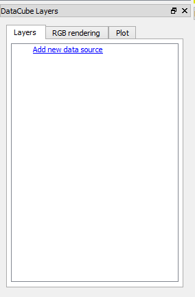
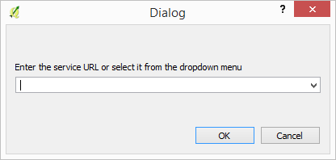
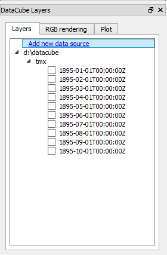
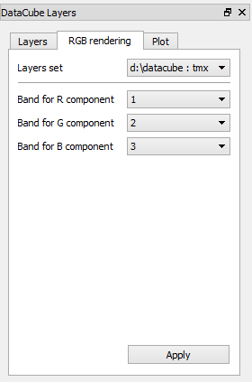
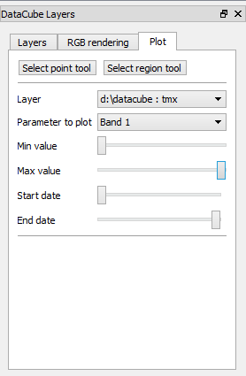
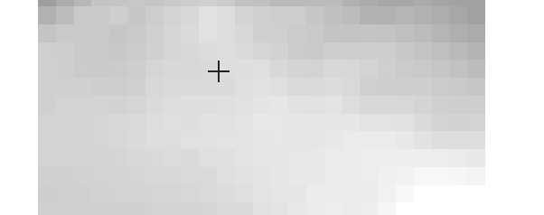
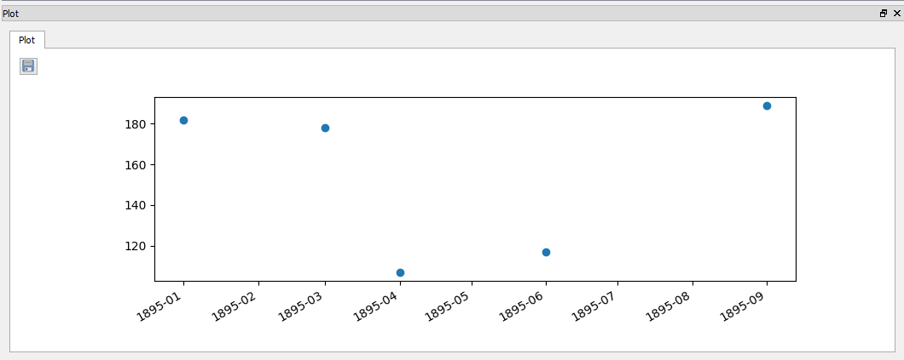
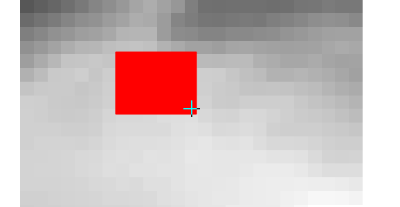
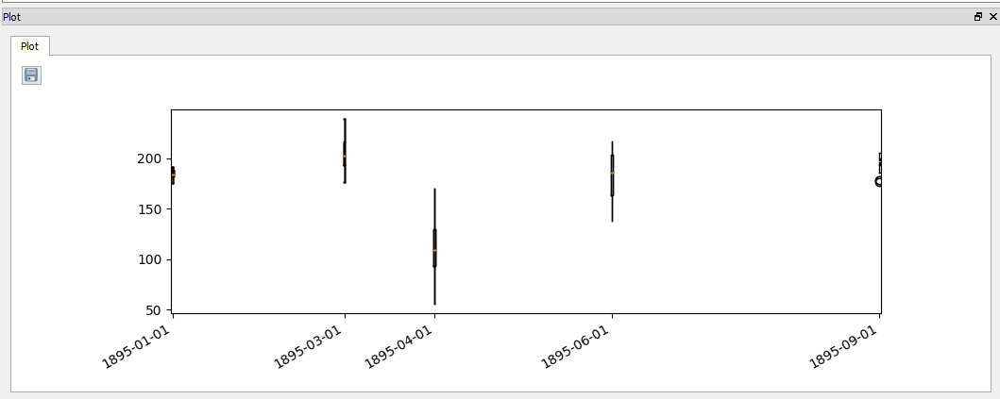
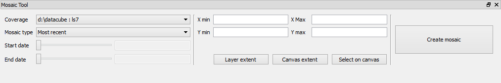

.. (c) 2016 Boundless, http://boundlessgeo.com
   This code is licensed under the GPL 2.0 license.

.. _usage:

Usage
=====

The plugin functionality is accessible through two main elements: The layers panel and the Mosaic panel. Both can be opened using the correpsonding menus in the plugins menu.

Data cube panel
----------------

It contains 3 tabs:

- Layers Tab: Used to add new endpoints and manage layers. 

The endpoint dialog allows to enter the location of the endpoint. Remote WCS endpoints can be added, and local filesystem folders as well. Endpoints added previously are remembered between sessions and available in the dropdown list.

When an endpoint is added, all available layers from it are added to this tab. With the corresponding checkbox, the layer can be added to or removed from the QGIS canvas. Layers are added to a layer group with the name of the coverage. The layer name is the timestamp of the layer.

Coverage entries in the layers tab have a download link. That allows to download the coverage (all available time positions) into a local folder. The resulting folder can be opened in the plugin as a valid endpoint, providing faster access. Individual layers are downloaded as GeoTiff files.

- RGB rendering tab: Allows to configure the R, G and B bands to use for all the layers from a given coverage, so they dont have to be changed one by one in  the QGIS layers panel.

All layers added to the QGIS project from a coverage will be automatically configured to use the selected rendering schema. Mosaic layers created from coverage layers will also be opened in QGIS suing that rendering schema.

- Plot tab: It contains elements to create and configure plots based on layer values.

The coverage to use and the parameter to plot must be defined in the corresponding dropdown list.

Tools for selecting pixels to plot can be activated in this tab:

The *Select Point Tool* allows the user to click in a single point. 

When the user clicks, the Plot panel is opened, and it shows a scatterplot with the values of the layers that are currently in the QGIS canvas for the selected coverage.

The *Select Region Tool* allows the user to draw a rectangle. 

When the user selects an extent in the map, the Plot panel is opened, and it shows a box and whiskers plot with the values of the layers that are currently in the QGIS canvas for the selected coverage.

The range of values and dates used for the plot can be controled with the sliders in the plot tab.

In the plot panel, the *Save* button allows the user to save the plot data as a CSV file

Mosaic Tool
***********

The mosaic tool produces derived layers based on the layers of a coverage. 

To create a mosaic you must select the following elements:

- The coverage to use. Not all layers available for that coverage in the endpoint are used, but only those that have been added to the QGIS project.

- The extent of the output mosaic layer. The extent of the current active layer in the QGIS layers panel, and the current extent of the project canvas can be selected. The extent can also be selected in the canvas, clicking and draggin, by clicking the *Select in canvas* to activate the corresponding map tool. 

-The time range of the layers to use.

- The criteria to use for selecting pixels from the available ones for a given location. Available ones include: more recent pixel, least recent, median and geomedian

Clicking on the *Create Mosaic* will lauch the mosaic creation process. Data is downloaded from the endpoint in 256x256 tiles, which are later processed individually according to the criteria defined. The final set of output tiles is loaded as a single layer in the current QGIS project, using a virtual raster layer (VRT). 